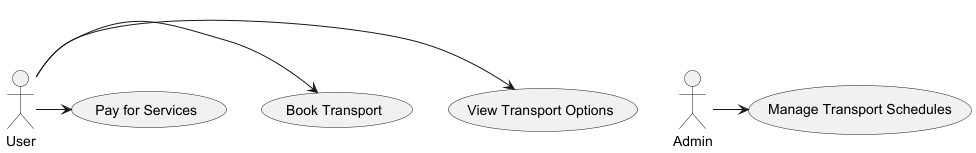

# Madrid's leisure Infraestructure Transport System

## Scope

The project aims to develop an integrated transport service system that enhances accessibility and connectivity to
leisure infrastructure in Madrid, specifically targeting attractions such as theme parks (Parque de Atracciones),
theaters, museums, and adventure activities. The focus is on creating a seamless experience for visitors and residents,
ensuring that they can easily navigate between these leisure destinations using various modes of transportation.[02_domain.md](02_domain.md)

## Domain

The domain encompasses urban transport services, leisure infrastructure, and tourism management within Madrid. It
includes considerations for public transport (buses, metro, trams), private transport (taxis, rideshares), and
alternative transport options (bicycles, walking paths). The domain also extends to the analysis of leisure demand
patterns, user experience, and service efficiency.

## Stakeholders

- Government Authorities: Local and regional transport departments, tourism boards, and urban planning agencies
  responsible for policy and infrastructure.
- Transport Service Providers: Public transport operators, private taxi services, rideshare companies, and bike-sharing
  services.
- Leisure Infrastructure Operators: Management teams of theme parks, theaters, museums, and adventure activity
  providers.
- Visitors and Residents: Individuals using the transport services to access leisure activities, including tourists and
  local residents.
- Community Organizations: Local groups advocating for sustainable transport and community engagement.
- Businesses: Local businesses near leisure attractions that may benefit from increased foot traffic.
- Emergency Services: Police, fire departments, and medical services responsible for responding to incidents and
  emergencies within the transport system.
- Technology Providers: Companies offering software solutions for transport management, booking platforms, and data
  analytics.
- Regulatory Bodies: Organizations overseeing compliance with transport regulations, data protection laws, and consumer
  rights.
- Environmental Groups: Non-profit organizations promoting sustainable transport practices and environmental
  conservation.
- Media Outlets: News agencies, travel blogs, and social media influencers covering transport services and leisure
  activities in Madrid.

## Constituent Systems

- Public Transport System: Metro, buses, and trams that connect major leisure attractions.
- Private Transport Options: Taxi services and rideshare applications facilitating door-to-door transport.
- Bicycle and Pedestrian Infrastructure: Bike lanes, shared bike services, and pedestrian walkways enhancing
  accessibility.
- Information and Booking Platforms: Mobile applications and websites that provide real-time transport information and
  ticket booking for leisure activities.
- Parking Management Systems: Facilities and systems for managing parking near major attractions.

## Constituent Constraints

- Regulatory Compliance: Adherence to local, regional, and national transport regulations and safety standards.
- Budget Limitations: Financial constraints impacting infrastructure investment and operational costs.
- Environmental Impact: Ensuring that transport services minimize carbon footprint and promote sustainable practices.
- Technological Integration: Compatibility between various transport and information systems, requiring robust IT
  infrastructure.
- User Accessibility: Services must be accessible to individuals with disabilities and cater to diverse user needs.
- Operational Efficiency: Balancing service frequency and reliability with demand, especially during peak leisure times.

## Main Mission

The primary mission of the project is to create a cohesive and efficient transport service system that facilitates easy
access to leisure infrastructure in Madrid. By integrating various transport modes, enhancing user experience, and
promoting sustainable practices, the project aims to boost tourism, improve local economic activity, and enrich the
overall quality of life for residents and visitors alike.

## Requirements

### Functional Requirements

- Multi-Modal Transport Integration: The system must provide options for various transport modes (metro, buses, taxis,
  bike-sharing) to facilitate seamless transitions between them.
- Real-Time Information:Users must receive up-to-date information about transport schedules, availability, and delays
  via a mobile application and website.
- Booking and Payment System:The platform should enable users to book and pay for transport services and entry tickets
  to leisure activities in a single transaction.
- User Profiles and Preferences:Users should be able to create profiles to save preferences, previous trips, and
  favorite leisure destinations.
- Route Planning: The system must offer personalized route recommendations based on user location, preferences, and
  traffic conditions.
- Accessibility Features:Ensure that all transport modes and the booking platform are fully accessible to individuals
  with disabilities.
- Promotions and Discounts:Provide users with information about promotions or discounts for combined transport and
  leisure activity packages.
- Feedback Mechanism:Implement a system for users to provide feedback on transport services and leisure activities to
  improve offerings.
- Emergency Services Integration:Ensure that the system includes features for users to contact emergency services or
  report issues while using transport services.
- Cross-Promotion of Leisure Activities:Integrate suggestions for nearby leisure activities based on the user’s current
  location or transport route.

### Non-Functional Requirements

- Performance and Scalability:The system should handle high volumes of users, especially during peak tourist seasons,
  without performance degradation.
- Usability:The mobile application and website must have an intuitive user interface, ensuring easy navigation and quick
  access to services.
- Reliability:Transport services should maintain a high level of reliability with minimal downtime, especially during
  operational hours.
- Security:User data must be protected through robust security measures, including encryption for payment processing and
  personal information.
- Interoperability: The system should seamlessly interact with existing transport and leisure infrastructure systems in
  Madrid.
- Maintainability: The system should be designed for easy updates and maintenance to incorporate user feedback and new
  features.
- Sustainability: Transport services should promote eco-friendly practices and minimize the environmental impact of
  operations.
- Data Accuracy: Ensure that all information related to transport schedules, availability, and leisure activities is
  accurate and updated regularly.
- Localization: The platform should support multiple languages to cater to diverse visitors, particularly tourists.

### Domain Requirements

- Compliance with Local Regulations: All transport services must comply with local transportation laws and safety
  regulations.
- Integration with Existing Infrastructure: The system should work within the existing urban transport framework and
  integrate with current transport schedules and routes.
- Tourism and Cultural Considerations: Recognize and accommodate the unique cultural aspects of Madrid, including
  special events, festivals, and local customs that may affect transport needs.
- Partnerships with Local Businesses: Establish partnerships with local leisure operators to ensure a comprehensive
  service offering and cross-promotion of activities.
- Monitoring and Evaluation: Implement a system for monitoring the usage of transport services and leisure activities to
  evaluate performance and user satisfaction.

# Use Case diagram

# Class diagram

