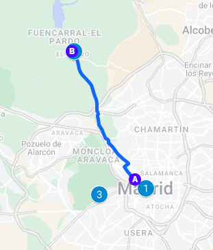
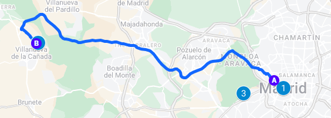
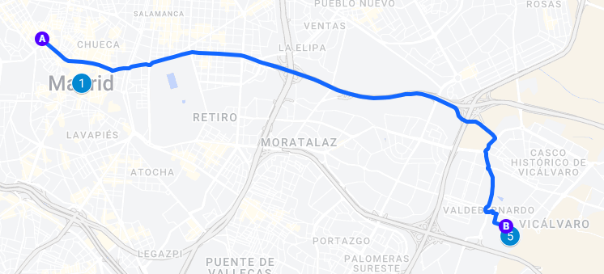
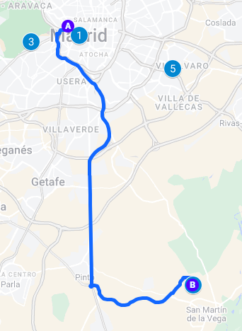
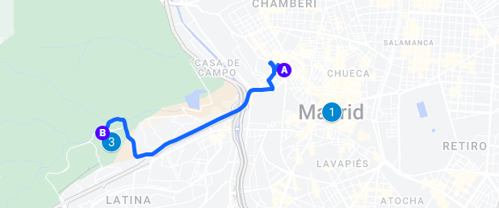
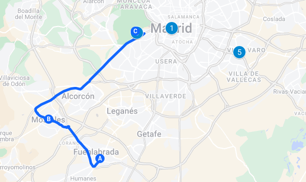
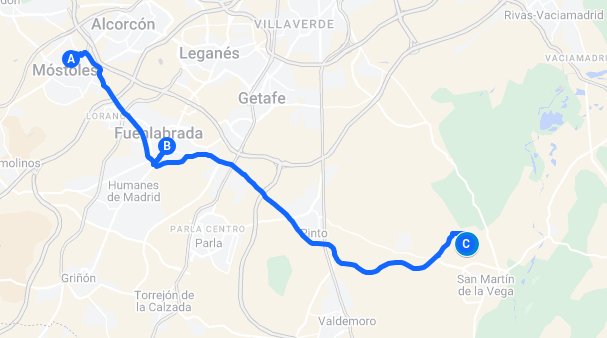
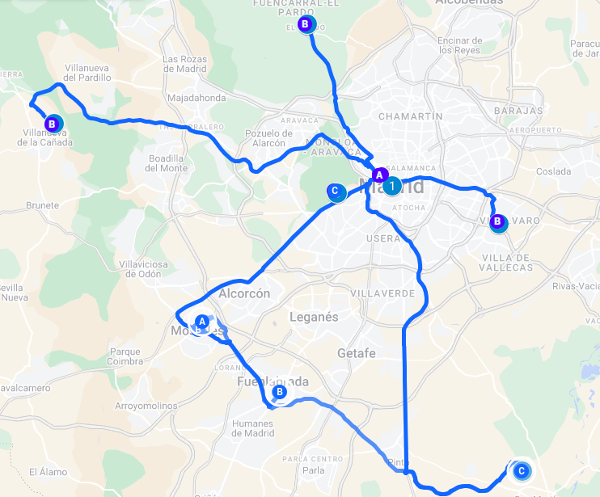

# Type of Project / Description

A new bus line has been launched within the Community of Madrid, connecting various neighborhoods with a range of leisure destinations across the city. This service is designed to improve access to popular entertainment venues, parks, and cultural attractions, facilitating easier experiences for both residents and visitors in exploring the offerings of Madrid. With convenient stops and frequent schedules, this bus line aims to provide a reliable and enjoyable transportation option for individuals seeking to engage with the city’s vibrant social scene. Passengers will have access to real-time information about bus schedules and routes through multiple channels, including bus stop displays, the official website, and a mobile application.

## Bus Line Map: Community of Madrid to Leisure Places

### Route Overview

- **Starting Points**:
#### 1. Plaza de España (City Center)

#### 2. Fuenlabrada Center

- **Ending Points**:
  1. Zoo Aquarium of Madrid / Parque de Atracciones
  2. El Pardo Park
  3. Faunia
  4. Aquopolis
  5. Parque Warner (Only from Fuenlabrada)
  
- **Number of Stops**: 
  - From Plaza de España: No stops (direct routes)
  - From Fuenlabrada: 1 stop in Móstoles Center (except Parque Warner route)
  
- **Approximate Time**: 
  - Varies depending on traffic, average of **35 minutes** for all routes.

---

### Additional Notes

- **Bus Frequency**: 
  - Every 2 hours, starting at **08:30 AM** and finishing at **8:30 PM**.
  
- **Operating Hours**: 
  - From **08:30 AM to 8:30 PM**, with the last departure from Plaza de España and Fuenlabrada at 8:30 PM.
  
- **Other Info**: 
  - The route to **Aquopolis** operates only during the **summer period**.
  - Routes from **Fuenlabrada** serve **Parque Warner** and **Parque de Atracciones/Zoo** only.

---

# Assumptions of the System

- Each bus has a capacity of **48 passengers**. With buses operating every **2 hours** from **08:30 AM** to **8:30 PM**, there will be a total of **7 trips** per route each day. This allows for a potential transportation capacity of **336 passengers per day** for each route. 

- For routes originating from **Plaza de España**, which connect to four destinations, the cumulative transportation capacity is **1,344 passengers per day** across all destinations. For routes originating from **Fuenlabrada/Móstoles**, which connect to two destinations, the cumulative transportation capacity is **672 passengers per day**. This results in an overall potential capacity of **2,016 passengers** daily across all routes.

- Based on anticipated demand, an average of **35 to 45 passengers per trip** is expected, which corresponds to an occupancy rate of approximately **90-95%** of the bus's full capacity. Such high occupancy rates confirm that the operation of each bus is justified, effectively accommodating visitors to leisure destinations.

- Tickets can be purchased online or directly on the bus. This means that ticket reservations can only be made online, as there is no physical bus station where tickets can be bought.

- Buses will transmit information to the control center at regular intervals every 10 minutes. This scheduled communication will ensure that the control center maintains a constant flow of real-time data regarding the location and operational status of each bus in the fleet.

- The traffic management system will be capable of identifying and predicting delays caused by traffic in real time. This functionality will enable the control center to make necessary adjustments to routes and schedules, ensuring that service remains efficient and reliable for all passengers. By proactively addressing potential delays, the system can enhance the overall travel experience and minimize disruption to the bus schedule. Additionally, the system will be equipped to modify routes in response to roadworks, public events, or demonstrations, allowing for seamless adaptation to changing traffic conditions.

- It is assumed that 4G network coverage will be sufficient along the entire bus route to enable continuous communication between the bus and the control center, as operations will occur in areas within the Community of Madrid. This reliable coverage will ensure uninterrupted connectivity at all times, which is also essential for processing card payments and mobile transactions.

- The system will be capable of handling adverse weather conditions, and specific protocols will be implemented to ensure the safety of passengers and drivers in these situations.

- Each bus will undergo regularly scheduled preventive maintenance, thereby minimizing the risk of mechanical failures during operation.

# Stakeholders

- End-users (passengers)
- Local government and public transport authorities in Madrid.
- Control Center: responsible for continuously monitoring the bus fleet, making real-time adjustments to schedules, and responding swiftly to any incidents or delays.
- Developers: responsible for designing and maintaining the ticketing system, reservation platform (both the mobile app and website), and real-time bus tracking features. They also handle the integration of the onboard communication system with the control center, ensuring seamless GPS tracking, 4G payments, and real-time updates.
- Bus drivers
- GPS, telecommunications, technology and radio communication providers: responsible for ensuring location tracking, 4G coverage, presence sensor, speaker and secure radio communication between the bus drivers and the control center.
- Providers of air conditioning system.
- Payment processing companies ensuring seamless transactions on the bus and online.
- Bus Maintenance and Cleaning Company, including fuel refueling.
- Workshops: including parts replacement service, tow trucks, etc.
- Leisure Destinations: offering joint promotions or discounts to passengers.

# Summary of Requirements

## Functional Requirements
- **FUN-LOC-001** (Geolocation of buses): The system shall continuously monitor and track the real-time location of each bus, displaying this information on the control center dashboard and through online features accessible to passengers.
- **FUN-STATUS-002** (Bus status): The onboard system shall monitor and report the operational status of the bus, including whether it is out of service, stationary, fully occupied, its current route, its location on the route, any faults detected, if it is stuck in traffic...
- **FUN-HIST-003** (Historical database): Each bus shall maintain a local database to log events such as breakdowns, passenger counts per trip, and significant delays. This information must be transmitted to the control center for analysis.
- **FUN-OCCUP-004** (Occupancy level): The onboard system shall monitor and report the number of available seats in real-time, updating both the control center and the digital passenger services.
- **FUN-COMM-005** (Driver Communication): The system shall facilitate two-way communication between the bus driver and the control center for urgent information exchange, including the start and end of routes, incidents, and significant delays.
- **FUN-PANL-006** (Passenger information panel): The onboard passenger information panel shall display real-time updates about the bus route, including upcoming stops, arrival times, delays, and route deviations due to events, construction work, or traffic.
- **FUN-PANL-007** (Passenger information at bus stops): The information panels at bus stops shall display the estimated wait time for the next bus, the number of available seats, and any route deviations.
- **FUN-ONL-008** (Online Passenger Information): The system shall offer passengers real-time updates regarding bus schedules, current locations, and estimated arrival times. Additionally, it shall feature an interactive map displaying all bus stop locations, along with comprehensive details about the destinations served by each stop and the ticket prices for every route.
- **FUN-TICK-009** (Online Ticket Reservation): The system shall enable passengers to make ticket reservations online, ensuring that all data is synchronized with the central server.
- **FUN-PAY-010** (Payment): Users must have the option to purchase their tickets either directly on the bus or online.
- **FUN-DRV-011** (Driver Management System): A system to track which driver is assigned to each bus and to manage situations where a driver is unavailable (e.g., due to leave or illness).
- **FUN-PSG-012** (Passenger Quality Survey): A quality survey for passengers along with a complaint form.
- **FUN-USER-013** (User Profiles and Subscription): The system shall provide an online subscription feature that allows users to create profiles to save their preferences, previous trips, and favorite leisure destinations.
- **FUN-ALERT-014** (Real-Time Alerts): The system shall send notifications exclusively to subscribed users regarding transport delays, route changes, or special promotions for leisure activities.

## Non-Functional Requirements
- **NFUNC-INFO-015** (Passenger Information Access): Passengers will have access to online information through both a dedicated mobile app and the official website, ensuring they have the latest updates and details at their fingertips.
- **NFUNC-SUBS-016** (Subscription Notifications): Subscriptions will be managed via email, where users will receive all relevant notifications and confirmations regarding their service preferences.
- **NFUNC-BILAN-017** (Bilingual Support): Both the mobile app and the website will be available in two languages, offering content in Spanish and English to accommodate a diverse user base.
- **NFUNC-COMM-018** (Driver-Control Center Communication): Communication between the bus driver and the control center regarding the start and end of routes, as well as any incidents, will primarily take place via radio. If there are any issues with radio communication, alternative messages can be sent to ensure effective communication.
- **NFUNC-DATA-019** (Real-Time Data Transmission): The onboard system of the bus will periodically and automatically send the information collected during the journey every five minutes via a 4G connection. This information will include data on the bus's location, the number of passengers, and the mechanical status. Similarly, the control center will be able to send commands or modifications to the bus using the same communication channel, ensuring continuous and effective interaction between both systems.
- **NFUNC-PAY-020** (Payments): Online payments made via card will be processed securely and without additional costs, provided that the cards are compatible with the Spanish payment system. Passengers will have the option to pay in cash or by card, including contactless payments, while on the bus.
- **NFUN-OCCUP-021** (Occupancy level): This can be measured either through ticket sales or with a presence sensor on the bus, which helps determine if a ticketed passenger has not boarded the vehicle.

## Operation Domain Requirements
- **DOM-ENV-022** (Operational Environment): The bus service shall operate effectively in urban areas, adapting to varying traffic conditions and road types.
- **DOM-REGULATIONS-023** (Compliance with Local Laws and Regulations): The bus service must comply with all local transportation regulations, safety standards, and environmental requirements applicable to the areas of operation.

## Quality Requirements
- **QUAL-CLM-024**: The bus shall be equipped with an air conditioning system to ensure passenger comfort.
- **QUAL-ACCESS-025**: The system must be accessible to people with disabilities. The bus will have an entrance for individuals with reduced mobility and a speaker to announce the next stop for visually impaired passengers. Additionally, the app will be compatible with the TalkBack accessibility too
- **QUAL-PERF-026**: The bus historical data shall be collected for subsequent analysis by the control center. This will enable improvements in performance and efficiency of the system, such as determining whether additional buses are needed at certain times of the day or adjusting routes for faster service.
- **QUAL-CNT-027**: Contingency plans shall be established to address issues with passengers, including serious health conditions, conflicts, and disruptive behaviors.
- **QUAL-EMER-028** (Emergency Response Planning): Develop protocols for responding to emergencies, accidents and natural disasters within the transport system to ensure user safety and service continuity.
- **QUAL-MAIN-029** (Maintainability): The system should be designed for easy updates and maintenance to incorporate user feedback and new features.
- **QUAL-ACC-030** (Data Accuracy): Ensure that all information related to transport schedules, availability, and leisure activities is accurate and updated regularly.
- **QUAL-COMP-031** (Compliance): The system must comply with data protection laws privacy regulations, and accessibility standards to ensure user trust and legal compliance. Implement privacy features such as data anonymization, consent management, and user control over personal information.
- **QUAL-SECPAY-032** (Secure Payments): The system shall implement strong security measures to safeguard user data, particularly during payment processing. This includes the use of encryption to guarantee that all transactions are secure and protected against unauthorized access.
- **QUAL-SECDATA-033** (Data Protection in Subscriptions and Authentication): Implement strong data protection measures for user subscriptions, ensuring that personal information is securely stored and managed. Utilize real authentication methods to verify user identities and prevent unauthorized access.
- **QUAL-SECCOMM-034** (Secure Communications): Ensure secure communication channels between the control center and the bus, protecting data transmitted during operational activities. This includes measures such as encryption and secure messaging protocols to safeguard user information and operational data.
- **QUAL-WRK-035**: The system must comply with labor laws regarding driver work hours, ensuring that no driver exceeds the maximum allowable driving time. This includes monitoring shift lengths and providing necessary breaks to guarantee the safety and well-being of all drivers.
- **QUAL-USAB-036** (Usability): The mobile application and website must have an intuitive user interface, ensuring easy navigation and quick access to services.

# Analyze the Impact of Quality Attributes

-------- Analyze the impact of quality attributes by creating a utility tree and prioritizing them by relevance and complexity to determine how they impact the architecture ----

# Use Case Diagram (Scenarios View)

# Class Diagram (Logical View)

# Sequence Diagrams (Process View)
